# Аким на 5 часов

[Презентация проекта (PDF)](<Аким на 5 часов.pdf>)

**AI-симулятор управления Астаной: 5 решений, 100 у.е. бюджета, один Astana Quality of Life Score.**

Пользователь в роли акима выбирает 5 из 14 городских мероприятий для пяти районов Астаны и должен уложиться в бюджет 100 у.е. Детерминированный движок проверяет правила ТЗ и считает Astana Quality of Life Score, воспроизводя эталоны ТЗ: базовый Score **52.56**, пример из ТЗ **56.54**. ИИ-советник объясняет результат, риски и компромиссы, вызывая движок через function calling. Все числа в ответе советника выводит код из результатов движка, а LLM добавляет только качественный комментарий.


> **Для жюри, 5 минут:** `.\run.bat` (Windows) или `bash run.sh` (Linux/macOS) запускает приложение с нуля. Нужен только Python 3.11–3.14; ключ ИИ не обязателен.
> Проверка расчётов без ключа ИИ: `.venv\Scripts\python -m pytest` (112 тестов) и `.venv\Scripts\python check.py` (эталоны ТЗ, лучший план, устойчивость; код выхода 1 при любом расхождении). На Linux/macOS — `.venv/bin/python`.
> Что установить, какие библиотеки и зачем, что работает без интернета и где в коде каждое требование ТЗ — в разделе [Для жюри: требования и чек-лист](#для-жюри-требования-и-чек-лист).

## Содержание

- [Ключевые возможности](#ключевые-возможности)
- [Скриншоты](#скриншоты)
- [Для жюри: требования и чек-лист](#для-жюри-требования-и-чек-лист)
- [Быстрый старт](#быстрый-старт)
- [Настройка ИИ-советника](#настройка-ии-советника)
- [Сценарий пользователя](#сценарий-пользователя)
- [Архитектура](#архитектура)
- [Как считается Score](#как-считается-score)
- [Проверка корректности](#проверка-корректности)
- [Ключевые результаты](#ключевые-результаты)
- [Почему LLM не считает числа](#почему-llm-не-считает-числа)
- [Городские события и устойчивость плана](#городские-события-и-устойчивость-плана)
- [Сравнение команд](#сравнение-команд)
- [Структура репозитория](#структура-репозитория)
- [Трактовки неоднозначностей ТЗ](#трактовки-неоднозначностей-тз)
- [Ограничения](#ограничения)
- [Планы развития](#планы-развития)

---

## Ключевые возможности

- **Карта районов Астаны.** Полноэкранная карта (MapLibre) с реальными границами районов из OpenStreetMap. Цвет района — его оценка D или любой из 10 показателей, есть переключатель «Было / Стало» и 3D-режим. Клик по району открывает его профиль. Сарайшык, шестой район, показан серым и без оценки: в датасете ТЗ для него нет показателей. Без сети районы показываются карточками.
- **Демо-сценарий.** Кнопка «Демо-сценарий» проводит по шагам: пример из ТЗ считается настоящим движком, затем открываются разбор решения и сравнение альтернатив.
- **Все правила ТЗ.** Ровно 5 мер, бюджет ≤ 100 у.е., не более 2 мер одного направления, районы у районных мер, несовместимости. Невалидный план не получает Score, а все нарушения показываются сразу и по-русски.
- **Score с полным разбором.** «Было/стало» по каждому району и показателю, устранённые и новые критические значения, сработавшие синергии, вклад каждой меры в Score.
- **Оптимизатор полным перебором.** Все 1 407 050 сценариев (наборы мер × районы) проверяются меньше чем за секунду. Результат — гарантированно лучший план, а не эвристика.
- **ИИ-советник с function calling.** Объясняет план, отвечает на «что если» и сам проверяет альтернативы через движок. OpenAI или NVIDIA; без ключа работает офлайн-разбор.
- **Городские события.** 8 кризисов, реалистичных для Астаны: буран, авария на теплосети, смог, секвестр бюджета и другие.
- **Устойчивость плана (наша оригинальная фича).** Как план переживает каждое событие, какой район страдает сильнее и какой план лучший в худшем случае.
- **Риски и компромиссы.** Отдельная панель показывает разгрузку дорог до и после, а также отрицательные эффекты мер с учётом лага (например, M11 снижает T1).
- **Планы команд.** Можно сохранить до 10 именованных планов, экспортировать и импортировать их в JSON и сравнить рейтингом в одних условиях. Присланным в JSON значениям Score сервер не верит и пересчитывает каждый план сам.
- **Краткая презентация решения.** Кнопка «Отчёт» открывает в приложении презентацию плана: состав, итог, районы, критические показатели, разбор. Её можно распечатать или сохранить в PDF.
- **Состояние не теряется.** План, событие, чат и планы команд сохраняются после F5. Кнопка «Сбросить» возвращает город в исходное состояние.
- **Воспроизводимость.** Запуск одной командой, 112 автотестов, `check.py` сверяет движок с эталонами ТЗ.

## Скриншоты

**Исходный город.** Score 52,56, бюджет 100 у.е., пустой план. Нура — самый слабый район.

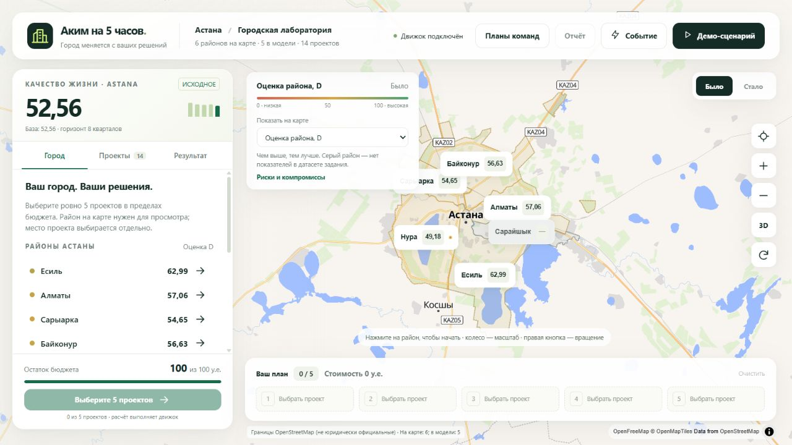

**План из ТЗ.** Пять проектов за 95 у.е. У районных мер указан район.

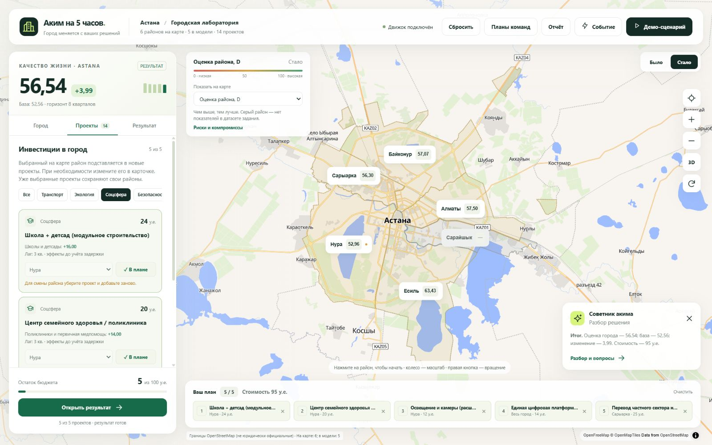

**Результат.** 52,56 → 56,54 (+3,99), критических показателей было 2, стало 0. Карта в режиме «Стало».

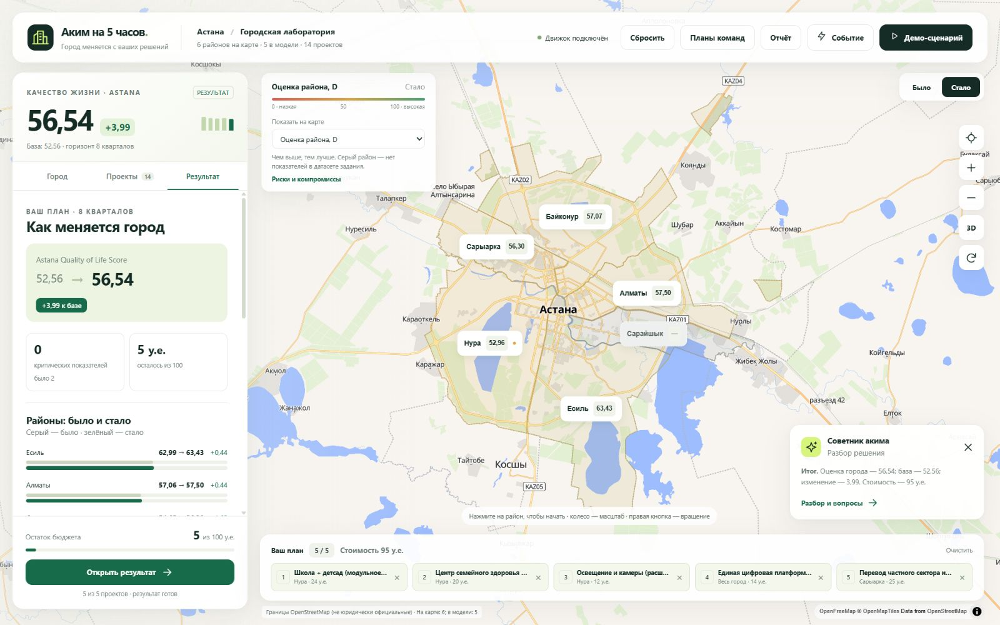

**Советник.** Разбор сильных сторон, рисков и последствий. Числа в отчёте выводит код из ответа движка, качественный комментарий добавляет ИИ.

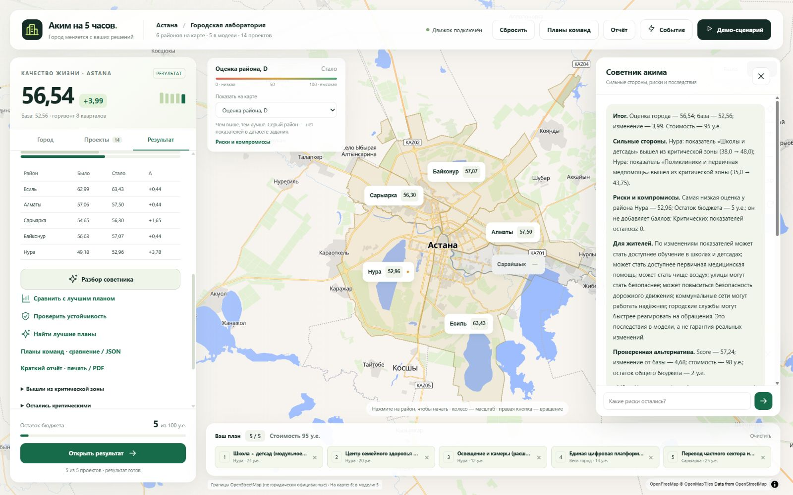

**Журнал инструментов.** ИИ сам вызвал `optimize`, видны аргументы и ответ движка: план 57,24 за 98 у.е.

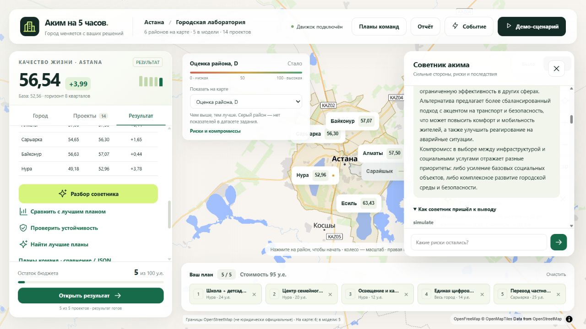

**Городское событие.** Пример ТЗ при аварии теплосети E1: Score 55,21 при базе события 51,22.

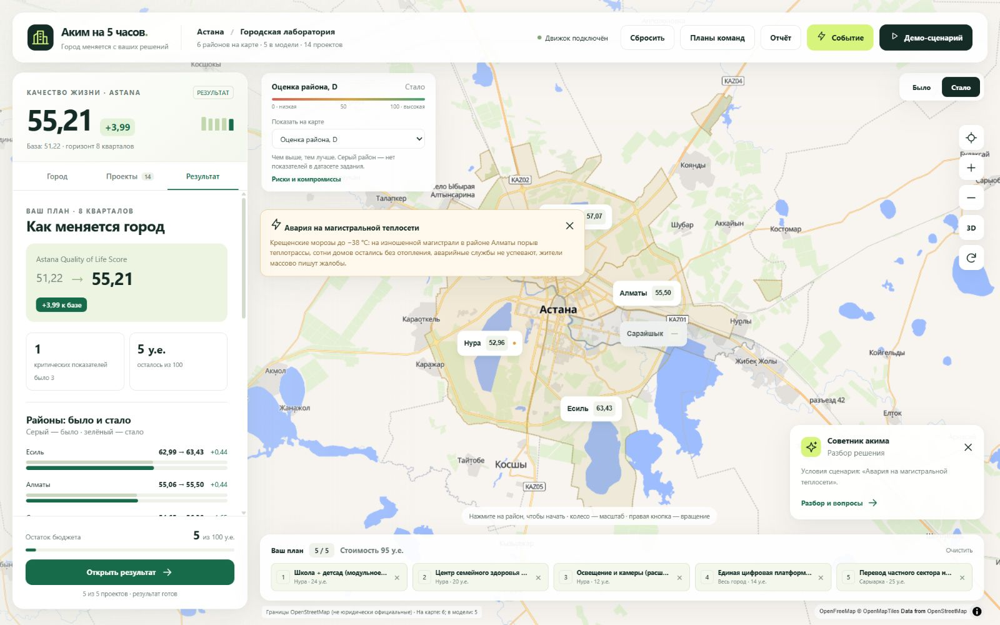

<details>
<summary>Ещё 10 экранов: лучший и устойчивый план, команды, отчёт, защита правил</summary>

| Экран | Что показано |
|---|---|
| 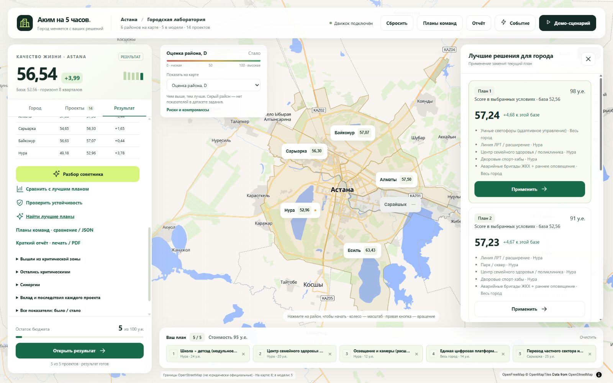 | Полный перебор: лучший план 57,24 за 98 у.е. (+4,68) |
| 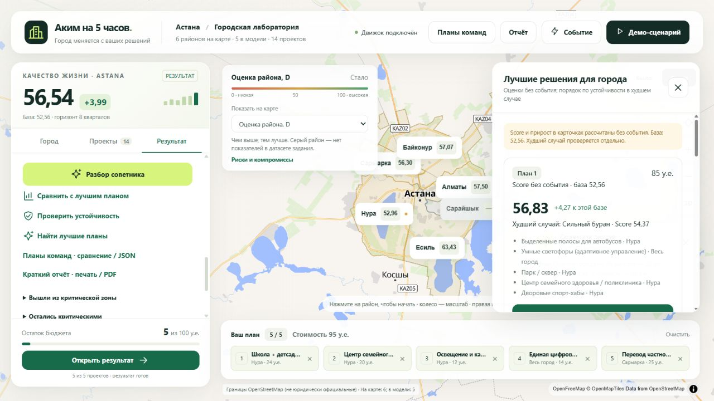 | Устойчивый поиск: 56,83 за 85 у.е., худший исход 54,37 при буране |
| 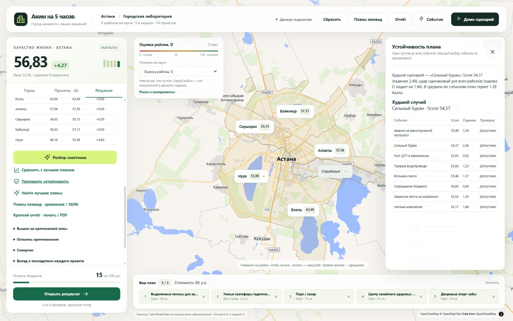 | Устойчивый план при каждом из 8 событий |
| 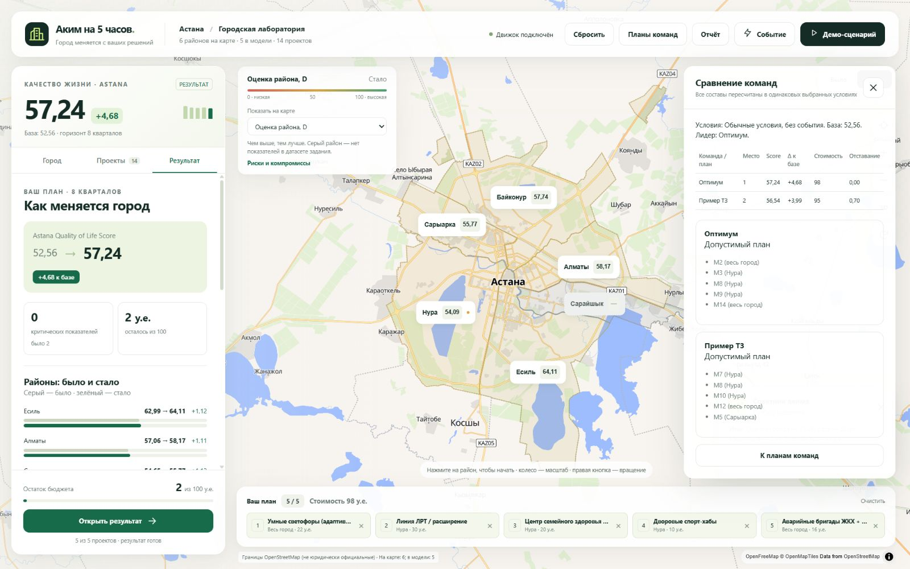 | Сравнение двух сохранённых планов в одних условиях: разрыв 0,70 |
| 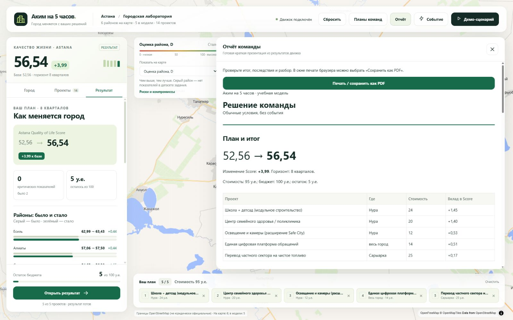 | Краткая презентация плана, печать или PDF |
| 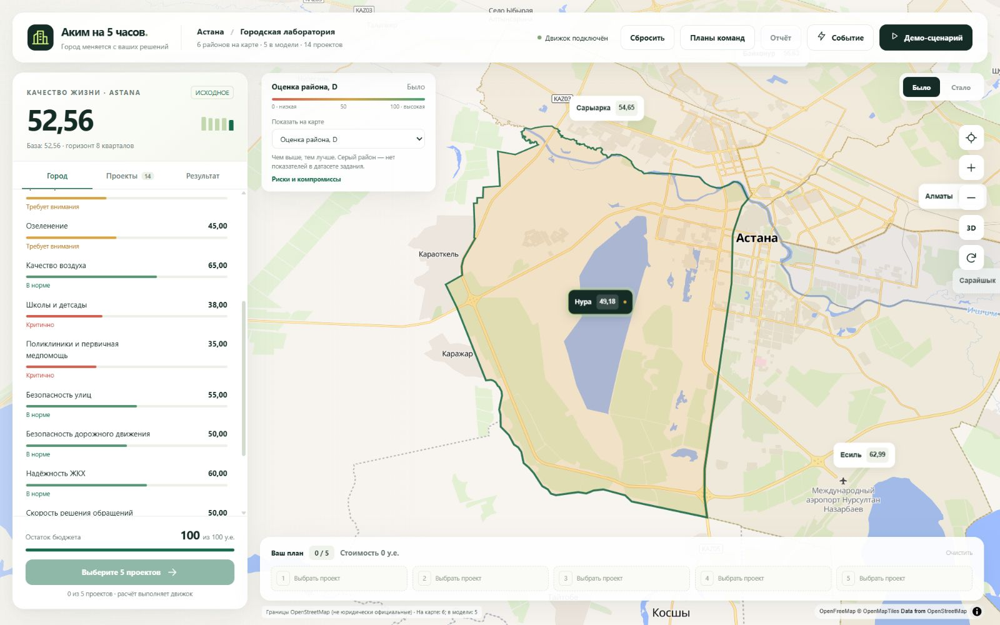 | Профиль Нуры: критические S1 = 38 и S2 = 35 |
| 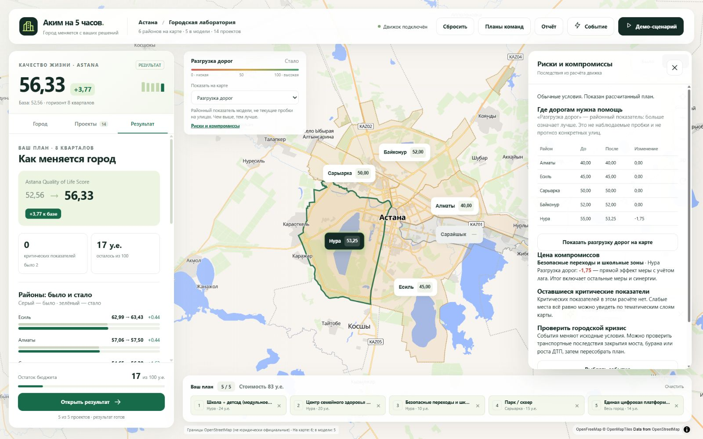 | Компромисс: безопасные переходы M11 снижают разгрузку дорог Нуры 55 → 53,25 |
| 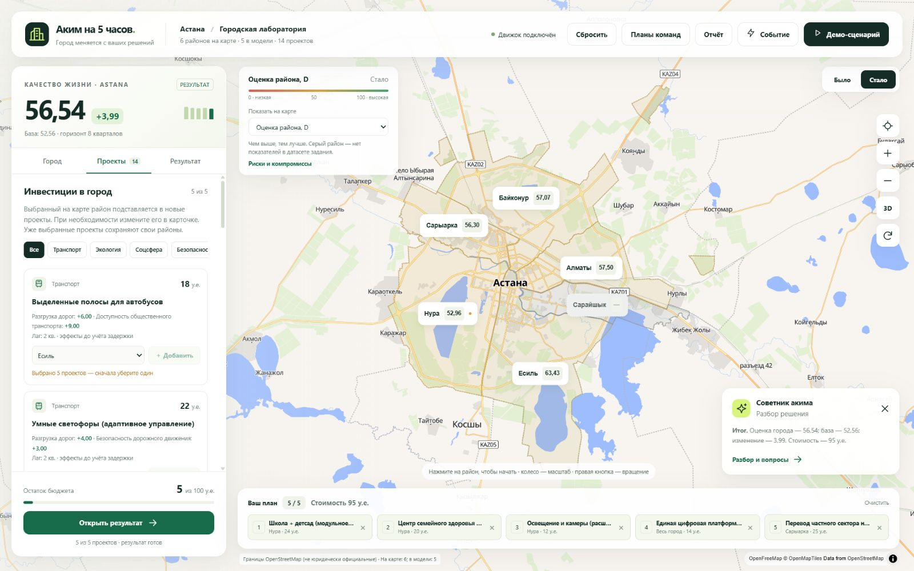 | Выбрано 5 проектов, добавить шестой нельзя |
| 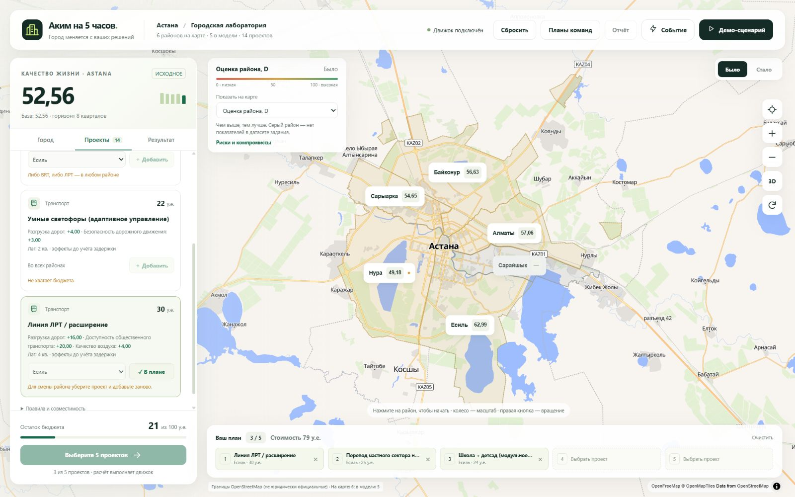 | Остаток 21 у.е., проект за 22 у.е. недоступен |
| 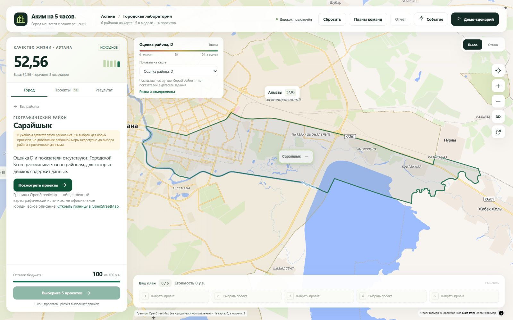 | Сарайшык на карте без выдуманных показателей |

</details>

---

## Для жюри: требования и чек-лист

### Что нужно на компьютере

| Что | Нужно ли |
|---|---|
| **Python 3.11–3.14** | Да, единственное обязательное требование. Чистая установка из свежего клона проверена на Python 3.11, 3.13 и 3.14. На Windows при установке с python.org отметьте «Add python.exe to PATH» |
| Node.js, npm, сборка фронтенда | Нет. Интерфейс — готовые HTML/CSS/JavaScript-файлы, их отдаёт Python-сервер |
| База данных, Docker | Нет. Docker — только альтернативный способ запуска |
| Ключ OpenAI / NVIDIA | Нет. Без ключа работают все расчёты, а советник даёт офлайн-разбор |
| Интернет | Для первой установки пакетов (~95 МБ), для тайлов подложки карты и онлайн-советника. Расчёты, оптимизатор и офлайн-советник работают без сети |
| Место на диске | Около 400 МБ под окружение `.venv` |
| Браузер | Современный Chrome, Edge или Firefox; для карты нужен WebGL. Без карты район выбирается по карточкам |
| Порт | 8501. Если он занят, задайте другой через `PORT` (см. [Быстрый старт](#быстрый-старт)) |

### Библиотеки

`run.bat` / `run.sh` ставят их сами из `requirements.txt` и `requirements-ui.txt`, вручную ничего устанавливать не нужно.

| Библиотека | Версия | Зачем | Где используется |
|---|---|---|---|
| `numpy` | ≥ 1.24 | Матрицы модели и векторный полный перебор 1,4 млн сценариев | `engine/` — обязательна |
| `pytest` | ≥ 7.0 | 112 автотестов движка | `tests/` |
| `openai` | ≥ 1.68, < 3 | Клиент OpenAI-совместимого API (OpenAI, NVIDIA), Chat Completions с function calling | `agent/advisor.py` — онлайн-советник |
| `python-dotenv` | ≥ 1.0, < 2 | Чтение настроек ИИ из `.env` | `agent/advisor.py` |
| `jsonschema` | ≥ 4.23, < 5 | Проверка аргументов, которые LLM передаёт в инструменты движка | `agent/tools.py` |
| `requests` | ≥ 2.31, < 3 | Загрузка границ районов и объектов из OpenStreetMap | `fetch_districts.py`, `fetch_real_context.py` — только для обновления гео-данных |
| `streamlit`, `pydeck`, `pandas` | см. `requirements-ui.txt` | Архивный прежний интерфейс и 2 его проверки в `agent.self_check` | `legacy/` — основной запуск их не импортирует |

HTTP-сервер написан на стандартной библиотеке Python (`http.server`), поэтому FastAPI, Flask или Django не нужны. `shapely` необязателен: `fetch_districts.py` с ним дополнительно проверяет топологию полигонов.

**Фронтенд и внешние сервисы:**

| Компонент | Как подключён |
|---|---|
| [MapLibre GL JS](https://maplibre.org/) 5.6.2 | Лежит в репозитории, `web/vendor/`, лицензия BSD-3-Clause. CDN не нужен |
| Тайлы подложки [OpenFreeMap](https://openfreemap.org/) | Загружаются из интернета. Без сети карта не рисуется, остаются карточки районов |
| Границы районов OpenStreetMap | Сохранены в `data/astana_districts.geojson` (© участники OpenStreetMap, ODbL) |
| OpenAI API или NVIDIA API | Необязательно, только для онлайн-советника |

**Альтернатива — точные версии.** `requirements-lock.txt` фиксирует 32 пакета активного приложения без архивного Streamlit (установка легче). Он требует Python ≥ 3.12 и проверен чистой установкой на Windows / Python 3.13.2 ([docs/LOCK_VALIDATION.md](docs/LOCK_VALIDATION.md)):

```bash
python -m venv .venv
.venv/bin/python -m pip install -r requirements-lock.txt     # Windows: .venv\Scripts\python ...
.venv/bin/python -B app.py --open
```

### Проверка за 5 минут

1. Запустите `.\run.bat` (Windows) или `bash run.sh`. Откроется http://localhost:8501.
2. Пройдите [контрольный сценарий](#сценарий-пользователя): база **52,56** → пример ТЗ **56,54** → лучший план **57,24** → попытка превысить бюджет блокируется.
3. На вкладке «Результат» откройте «Разбор советника» и раскройте «Как советник пришёл к выводу»: там реальные вызовы движка с аргументами.
4. В новом терминале выполните `.venv\Scripts\python check.py`. Последняя строка — «ИТОГ: все 12 проверок пройдены.» (на Linux/macOS — `.venv/bin/python check.py`).

### Соответствие ТЗ

| Требование ТЗ | Как выполнено | Где проверить |
|---|---|---|
| Единый виртуальный бюджет для всех | Бюджет 100 у.е. и исходные данные районов одни для всех, хранятся в `data/city_data.json` | Стартовый экран: 52,56 и 100 у.е.; `check.py`, раздел 1 |
| Решения по 5 направлениям | 14 мер в 5 направлениях, ровно 5 решений, не более 2 мер одного направления | Вкладка «Проекты»; `engine/validation.py` |
| Автоматический контроль бюджета | Интерфейс блокирует недоступные меры, движок отклоняет план с причиной, и такой план не получает Score | Скриншот «Лимит бюджета»; `tests/test_engine.py::test_rule_budget_exceeded` |
| AI-анализ решений | Советник с function calling вызывает 7 инструментов движка | «Разбор советника» и журнал вызовов; `agent/advisor.py`, `agent/tools.py` |
| Расчёт Astana Quality of Life Score | Формула ТЗ, все коэффициенты берутся из данных | `engine/model.py`; эталоны 52,56 и 56,54 в `check.py` |
| Сильные стороны, риски, последствия | Разбор советника, критические показатели, синергии, вклад каждой меры | Вкладка «Результат», «Разбор советника» |
| Критерий: решения меняют Score | Перенос одной меры в другой район меняет Score, а порядок решений на результат не влияет | `tests/test_engine.py::test_changing_decisions_changes_score`, `::test_decision_order_does_not_matter` |
| *Опц.:* сравнение команд | «Планы команд», JSON-импорт и экспорт, рейтинг через `engine.compare` | Кнопка «Планы команд» |
| *Опц.:* визуализация районов | Карта «Было / Стало», слои по 10 показателям, полосы по районам | Карта, вкладка «Результат» |
| *Опц.:* AI-рекомендации | Советник проверяет альтернативы через `optimize` и `simulate` | Журнал вызовов советника |
| *Опц.:* городские события | 8 событий, в том числе секвестр бюджета, и поиск устойчивого плана | Кнопка «Событие», панель «Устойчивость плана» |
| *Опц.:* краткая презентация | «Отчёт»: презентация плана с печатью или сохранением в PDF (файл PPTX не создаётся) | Кнопка «Отчёт» |

---

## Быстрый старт

Нужен **Python 3.11–3.14**. `app.py` запускает сервер `ui/web_server.py`: он поднимает локальный Python API и отдаёт HTML/JavaScript-интерфейс из `web/` на том же порту. Node.js, npm и сборка фронтенда не нужны. Скрипты запуска предусмотрены для Windows, Linux и macOS; Docker использует Python 3.12.

```bash
git clone https://github.com/BAITC-Hacks/hack-d3b2c613-stupits.git
cd hack-d3b2c613-stupits
```

| Система | Одна команда |
|---|---|
| Windows (cmd или PowerShell) | `.\run.bat` (или двойной щелчок по файлу) |
| Linux / macOS | `bash run.sh` |

Скрипт делает всё сам:

1. создаёт виртуальное окружение `.venv`, если его нет (сам находит Python 3.11–3.14);
2. ставит зависимости из `requirements.txt` и `requirements-ui.txt`; при следующих запусках повторно ставит, только если эти файлы изменились;
3. создаёт `.env` из `.env.example`, если его нет;
4. запускает приложение и открывает в браузере **http://localhost:8501**.

Первый запуск устанавливает Python-зависимости (около 95 МБ пакетов, окружение `.venv` занимает около 400 МБ) и может занять несколько минут; дальше приложение стартует за секунды. Интерфейс работает в браузере через локальный API, сервер слушает только `127.0.0.1`. Расчёты, оптимизатор и офлайн-советник работают без сети. Интернет нужен для установки пакетов, тайлов карты и онлайн-советника. Остановить приложение — `Ctrl+C`.

MapLibre хранится локально в `web/vendor/`; интернет нужен для тайлов подложки. Если тайлы или GeoJSON недоступны, район можно выбрать по карточкам.

Необязательные настройки: `PYTHON` — какой интерпретатор использовать, `PORT` — другой порт, `NO_BROWSER=1` — не открывать браузер. Например, запуск на порту 8502:

| Где | Команда |
|---|---|
| Linux / macOS | `PORT=8502 bash run.sh` (другой Python: `PYTHON=python3.11 bash run.sh`) |
| Windows, cmd | `set "PORT=8502" && .\run.bat` |
| Windows, PowerShell | `$env:PORT = "8502"; .\run.bat` |

<details>
<summary>Запуск вручную, без скрипта</summary>

Ставятся оба файла зависимостей; окружение не нужно активировать.

Linux / macOS:

```bash
python3 -m venv .venv
.venv/bin/python -m pip install -r requirements.txt -r requirements-ui.txt
cp .env.example .env
.venv/bin/python -B app.py --host 127.0.0.1 --port 8501 --open
```

Windows (cmd или PowerShell):

```bat
python -m venv .venv
.venv\Scripts\python -m pip install -r requirements.txt -r requirements-ui.txt
copy .env.example .env
.venv\Scripts\python -B app.py --host 127.0.0.1 --port 8501 --open
```

</details>

Если `.env` уже настроен, пропустите команду его копирования. `--open` открывает браузер; без этого флага сервер работает без открытия окна. Проверка готовности: **http://localhost:8501/api/health**. Для запуска на другом порту измените `--port`.

<details>
<summary>Запуск в Docker</summary>

```bash
docker build -t akim5h .
cp .env.example .env                              # Windows: copy .env.example .env
docker run --rm -p 8501:8501 --env-file .env akim5h
```

Затем откройте http://localhost:8501. Образ использует Python 3.12 и запускает `app.py --host 0.0.0.0 --port 8501` без прав root; health-check обращается к `/api/health`. Ключ ИИ в образ не попадает: `.env` исключён в `.dockerignore` и передаётся только при запуске через `--env-file`. Без ключа советник работает в офлайн-режиме; параметр `--env-file .env` можно опустить.

</details>

---

## Настройка ИИ-советника

**Ключ не обязателен.** Без него работает всё: карта, план, проверка правил, Score, оптимизатор. Советник в этом случае даёт детерминированный офлайн-разбор по данным движка.

Чтобы включить LLM, впишите ключ в `.env`. Этот файл создают `run.bat` / `run.sh`; он в `.gitignore` и в репозиторий не попадёт. Рабочая модель `gpt-4.1-mini` уже указана в шаблоне, поэтому для OpenAI достаточно ключа:

```dotenv
OPENAI_API_KEY=ваш_ключ
OPENAI_MODEL=gpt-4.1-mini
OPENAI_BASE_URL=
```

| Переменная | OpenAI | NVIDIA (build.nvidia.com) |
|---|---|---|
| `OPENAI_API_KEY` | ключ `sk-…` | ключ `nvapi-…` |
| `OPENAI_MODEL` | `gpt-4.1-mini` (проверена) или другая модель с function calling в Chat Completions API | id модели из каталога, у которой заявлен tool calling |
| `OPENAI_BASE_URL` | оставить пустым | `https://integrate.api.nvidia.com/v1` |

- Советник работает с любым OpenAI-совместимым API. Адрес указывается без `/chat/completions`, SDK добавляет его сам.
- Значения пишутся без кавычек. Переменные окружения процесса важнее `.env`.
- `.env` перечитывается при каждом обращении к советнику. После изменения настроек задайте новый вопрос либо перезагрузите страницу и снова рассчитайте пример, чтобы получить новый автоматический разбор.
- **Офлайн-режим** включается сам, если не заданы ключ или модель, а также при ошибке авторизации, сбое сети, тайм-ауте или ответе, не прошедшем проверку чисел. Ответ помечается «Советник работает в офлайн-режиме».

Подробности: [agent/README.md](agent/README.md).

---

## Сценарий пользователя

1. **Открыть город.** Карта Астаны на весь экран, районы окрашены по оценке D. Слева — «Качество жизни · Astana» (база **52,56**, метка «ИСХОДНОЕ») и остаток бюджета. Клик по району открывает его профиль с показателями и кнопкой «Выбрать проекты» и подставляет район в новые районные проекты. Быстрый старт — кнопка «Попробовать план из ТЗ» на вкладке «Город».
2. **Собрать план.** Вкладка «Проекты»: 14 мер со стоимостью, лагом и эффектами. Выбранные меры попадают в ленту «Ваш план» из 5 слотов. Если меру добавить нельзя (не хватает бюджета, лимит направления, несовместимость), интерфейс объясняет почему.
3. **Рассчитать.** «Рассчитать результат»: Score и его изменение, вкладка «Результат», карта переключается между «Было» и «Стало». Невалидный план Score не получает, все причины показываются сразу.
4. **Найти лучшее.** «Найти лучший план» открывает панель «Лучшие решения для города»: лучшие планы полного перебора и сравнение с вашим. «Применить» подставляет выбранный план.
5. **Проверить на прочность.** Панель «Устойчивость плана» показывает Score при каждом из 8 событий и худший случай. Кнопка «Событие» в шапке меняет исходные условия города, например буран или секвестр бюджета.
6. **Спросить советника.** На вкладке «Результат» нажмите «Разбор советника»: откроется боковая панель с объяснением и чатом. Карточка «Советник акима» показывает краткий разбор. Блок «Как советник пришёл к выводу» содержит инструменты, аргументы и результаты.
7. **Сравнить и показать.** «Планы команд» сохраняет текущий план под именем, сравнивает до 10 планов в одних условиях и переносит их через JSON-файл. «Отчёт» открывает краткую презентацию решения для печати или сохранения в PDF. «Сбросить» возвращает исходный город, сохранённые планы команд при этом остаются.

Кнопка **«Демо-сценарий»** проходит эти шаги за минуту: знакомство с городом, «Рассчитать пример» (пример ТЗ через настоящий движок), разбор решения, сравнение альтернатив.

**Контрольный сценарий** (значения в интерфейсе выводятся с запятой):

| Действие | Ожидаемый результат |
|---|---|
| Открыть приложение, ничего не выбирать | Качество жизни **52,56** |
| «Попробовать план из ТЗ» или «Демо-сценарий» → «Рассчитать пример» (вручную: M7, M8, M10 в Нуре, M12, M5 в Сарыарке) | **56,54** (+3,99), стоимость 95 |
| «Найти лучший план» | лучший план **57,24**, стоимость 98 |
| Выбрать 4 проекта или превысить бюджет | Расчёт недоступен, причина названа явно |

---

## Архитектура

Главный принцип: **считает код, объясняет ИИ.** Браузерный HTML/JavaScript-интерфейс вызывает локальный Python API, который обращается к движку и советнику. Движок не знает ни про HTTP, ни про LLM и проверяется отдельно. Числа интерфейс получает из движка, поэтому основной сценарий работает и без советника.

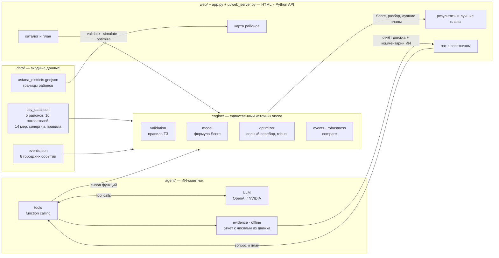
```mermaid
flowchart LR
    subgraph DATA["data/ — входные данные"]
        CD["city_data.json<br/>5 районов, 10 показателей,<br/>14 мер, синергии, правила"]
        EV["events.json<br/>8 городских событий"]
        GEO["astana_districts.geojson<br/>границы районов"]
    end

    subgraph ENGINE["engine/ — единственный источник чисел"]
        VAL["validation<br/>правила ТЗ"]
        MOD["model<br/>формула Score"]
        OPT["optimizer<br/>полный перебор, robust"]
        ROB["events · robustness<br/>compare"]
    end

    subgraph AGENT["agent/ — ИИ-советник"]
        LLM["LLM<br/>OpenAI / NVIDIA"]
        TOOLS["tools<br/>function calling"]
        EVI["evidence · offline<br/>отчёт с числами из движка"]
    end

    subgraph UI["web/ + app.py + ui/web_server.py — HTML и Python API"]
        MAP["карта районов"]
        PLAN["каталог и план"]
        RES["результаты и лучшие планы"]
        CHAT["чат с советником"]
    end

    CD --> ENGINE
    EV --> ENGINE
    GEO --> MAP
    PLAN -->|validate · simulate · optimize| ENGINE
    ENGINE -->|Score, разбор, лучшие планы| RES
    CHAT -->|вопрос и план| TOOLS
    TOOLS <-->|tool calls| LLM
    TOOLS -->|вызов функций| ENGINE
    TOOLS --> EVI
    EVI -->|отчёт движка + комментарий ИИ| CHAT
```

| Слой | Отвечает за | Ключевые файлы |
|---|---|---|
| `data/` | Данные ТЗ, события, границы районов | `city_data.json`, `events.json` |
| `engine/` | Правила, Score, оптимизатор, события, устойчивость, сравнение. Чистые функции, ответы — JSON-словари | `model.py`, `validation.py`, `optimizer.py` · API: [engine/README.md](engine/README.md) |
| `agent/` | Цикл LLM с инструментами движка, проверка чисел, офлайн-разбор | `advisor.py`, `tools.py`, `evidence.py` |
| `app.py`, `ui/web_server.py`, `web/` | Python API (стандартная библиотека, без фреймворков) и HTML/JavaScript-интерфейс: карта, каталог, результаты, лучшие планы, устойчивость, чат | `app.py`, `ui/web_server.py`, `web/interface.js`, `web/map.js` |

Как советник отвечает на вопрос:

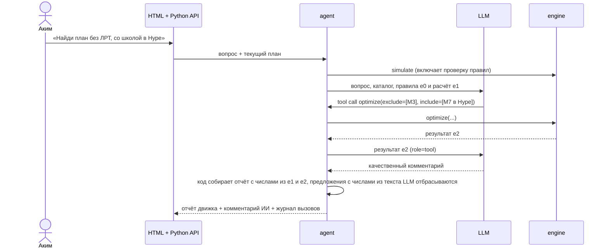
```mermaid
sequenceDiagram
    actor U as Аким
    participant UI as HTML + Python API
    participant A as agent
    participant L as LLM
    participant E as engine
    U->>UI: «Найди план без ЛРТ, со школой в Нуре»
    UI->>A: вопрос + текущий план
    A->>E: simulate (включает проверку правил)
    A->>L: вопрос, каталог, правила e0 и расчёт e1
    L->>A: tool call optimize(exclude=[M3], include=[M7 в Нуре])
    A->>E: optimize(...)
    E-->>A: результат e2
    A->>L: результат e2 (role=tool)
    L-->>A: качественный комментарий
    A->>A: код собирает отчёт с числами из e1 и e2, предложения с числами из текста LLM отбрасываются
    A-->>UI: отчёт движка + комментарий ИИ + журнал вызовов
```

---

## Как считается Score

Все коэффициенты берутся из `data/city_data.json`, в коде нет «зашитых» чисел.

**Шаг 1. Новые показатели района** (10 показателей, шкала 0–100, 100 — нет проблемы):

```math
I'_{dk} = \mathrm{clip}\Big(I_{dk} + \sum_{m \in S:\ d \in Z_m} e_{mk}\cdot\frac{8 - L_m}{8} + B_{dk},\ 0,\ 100\Big)
```

**Шаг 2–3. Оценка района и города:**

```math
D_d = \sum_{k} w_k \, I'_{dk}, \qquad D_{avg} = \sum_{d} p_d \, D_d
```

**Шаг 4. Итог:**

```math
\mathrm{Score} = 0.7 \cdot D_{avg} + 0.3 \cdot \min_d D_d - 1.0 \cdot N_{crit}
```

| Обозначение | Смысл |
|---|---|
| `S`, `Z_m` | выбранные меры; зона действия меры: один район (district) или весь город (city) |
| `e_mk`, `L_m` | эффект меры на показатель; лаг в кварталах. За горизонт 8 кварталов реализуется доля (8 − L)/8: например, школа M7 с лагом 3 даёт S1 +16 × 5/8 = **+10** |
| `B_dk` | бонус синергии (M1+M2, M10+M12, M5+M6): фиксированный, лагом не масштабируется, даётся в районе первой меры пары |
| `w_k` | веса показателей: T1, T2, C1, C2 — 0.10; S1, S2, E2 — 0.11; E1, B1, B2 — 0.09 (сумма 1) |
| `p_d` | доли населения: Есиль 0.27, Алматы 0.24, Сарыарка 0.20, Нура 0.16, Байконур 0.13 |
| `N_crit` | число пар «район × показатель» со значением **строго меньше 40**; каждая стоит −1 балл |

**Зачем такая формула.** 70% веса — общий уровень города, 30% — самый слабый район: нельзя «вылизать» один район и забыть про Нуру. Штраф за критические значения не даёт оставить провалы.

**Расчёт по шагам:**

| | Расчёт | Score |
|---|---|---|
| База, без мер | 0.7 × 56.86 + 0.3 × 49.18 − 1 × 2 (в Нуре S1 = 38, S2 = 35) | **52.56** |
| Пример ТЗ | 0.7 × 58.08 + 0.3 × 52.96 − 1 × 0 (оба провала Нуры устранены) | **56.54** |

---

## Проверка корректности

Движок детерминирован, поэтому его корректность проверяется автоматически, без LLM и без ключа. Команды используют окружение `.venv`, которое создаёт `run.bat` / `run.sh`; активировать его не нужно.

```bash
.venv/bin/python -m pytest               # 112 тестов, ~12 с
.venv/bin/python check.py                # эталоны ТЗ; код выхода 1, если что-то не совпало
.venv/bin/python -B -m agent.self_check  # 38 проверок советника без внешнего API
.venv/bin/python -B -m ui.web_check     # 14 проверок настоящего локального HTTP API
```

На Windows вместо `.venv/bin/python` пишите `.venv\Scripts\python`, например `.venv\Scripts\python -m pytest`.

**Эталонные числа ТЗ, которые воспроизводит движок:**

| Проверка | ТЗ | Движок |
|---|---|---|
| Базовый Score | 52.56 | **52.56** ✅ |
| D_avg и N_crit базы | 56.86; 2 (S1, S2 в Нуре) | 56.86; 2 ✅ |
| Оценки районов `base_D` | 62.99 / 57.06 / 54.65 / 56.63 / 49.18 | совпадают все пять ✅ |
| Пример ТЗ: стоимость и Score | 95; ≈ 56.5 (+4.0) | 95; **56.54** (+3.99) ✅ |
| Пример ТЗ: синергия M10 + M12 | срабатывает | B1 +2 в Нуре ✅ |
| Самый дешёвый набор M9 + M11 + M10 + M12 + M4 | 61, валиден | 61, валиден; дешевле 61 допустимых наборов нет ✅ |

**Что ещё проверяют тесты:**

- каждое правило валидации по отдельности и все нарушения сразу;
- лаг, синергии, вклад мер; независимость от порядка решений; изменение набора меняет Score;
- оптимизатор перебирает всё пространство (число сценариев сверяется с комбинаторикой), а его результат совпадает с медленным перебором «в лоб»;
- с событием показатели действительно падают, без события — ответы прежние (52.56 и 56.54);
- `robustness` возвращает все события, режим устойчивости совпадает с перебором «в лоб», `compare` правильно ранжирует;
- неверный ввод оптимизатора даёт понятную ошибку, а не исключение и не «тихую» работу. Это NaN и бесконечность в бюджете, число вместо списка, опечатка в поле, одна мера в двух районах, закреплённые меры, нарушающие правила;
- каждый план оптимизатора перед выдачей проходит `validate()`. Тест нарочно ломает быструю предпроверку перебора и убеждается, что невалидный план всё равно не попадает в выдачу;
- `check.py` возвращает код 0 на настоящих данных и код 1 при подменённом эталоне;
- битый файл данных отклоняется с понятной ошибкой, все ответы сериализуются в JSON.

`check.py` печатает эталоны с пометкой «совпадает» или «НЕ СОВПАДАЕТ», выводит таблицы из раздела ниже и заканчивает строкой «ИТОГ». При любом расхождении скрипт завершается с кодом 1, поэтому годится для CI.

---

## Ключевые результаты

**Полный перебор за доли секунды.** 2002 набора мер (C(14, 5)). 1181 из них проходят правила, не зависящие от районов (бюджет, направления, M1+M3), и только для них перебираются районы. Всего **1 407 050** сценариев «набор × районы», допустимых — 694 395. Все считаются векторно (numpy) по той же формуле, что и `simulate()`, за **~0.5 с** (0.45 с на Windows 11, Python 3.14).

| # | Score | Стоимость | План |
|---|---|---|---|
| 1 | **57.24** | 98 | M2 (весь город) + M3 (Нура) + M8 (Нура) + M9 (Нура) + M14 (весь город) |
| 2 | 57.23 | 91 | M3 + M4 + M8 + M9 (все в Нуре) + M14 (весь город) |
| 3 | 57.21 | 100 | M3 + M7 + M8 + M10 (все в Нуре) + M12 (весь город) |
| 4 | 57.19 | 88 | M3 + M8 + M9 + M10 (все в Нуре) + M14 (весь город) |
| 5 | 57.17 | 90 | M3 + M8 + M9 (все в Нуре) + M12 + M14 (весь город) |

- **Лучший план — 57.24 против 56.54 у примера ТЗ** (+0.70). Оптимум вкладывается в Нуру: это самый слабый район, а он входит в формулу с весом 30%. План закрывает оба критических провала соцсферы (M8, M9) и транспорт (ЛРТ M3).
- План №2 почти так же хорош (57.23) и стоит на 7 у.е. меньше: готовый аргумент для советника.
- **Самый устойчивый план** (`optimize(robust=True)`): **M1 + M4 + M8 + M9 в Нуре + M2 на весь город**, с синергией M1 + M2. Стоит 85 у.е., Score 56.83 — всего на 0.41 меньше лучшего, — но проходит при **всех 8 событиях**. Худший случай — буран, 54.37.

**Устойчивость к событиям** (Score при событии, в скобках — потеря):

| Событие | Лучший план (57.24, 98 у.е.) | Пример ТЗ (56.54, 95 у.е.) | Устойчивый план (56.83, 85 у.е.) |
|---|---|---|---|
| E1 Авария на теплосети (Алматы) | 55.90 (−1.34) | 55.21 (−1.34) | 55.49 (−1.34) |
| E2 Сильный буран (весь город) | 54.78 (−2.46) | 52.08 (−4.46) | 54.37 (−2.46) |
| E3 Рост ДТП (весь город) | 56.32 (−0.92) | 54.62 (−1.92) | 55.91 (−0.92) |
| E4 Прорыв водопровода (Байконур) | 57.01 (−0.23) | 55.32 (−1.23) | 55.60 (−1.23) |
| E5 Вспышка смога (Сарыарка) | 56.01 (−1.23) | 55.31 (−1.23) | 55.46 (−1.37) |
| E6 Сокращение бюджета (−15 у.е.) | ❌ не проходит: 98 > 85 | ❌ не проходит: 95 > 85 | **56.83 (без потерь)** |
| E7 Закрытие моста (Есиль) | 55.94 (−1.30) | 55.24 (−1.30) | 55.53 (−1.30) |
| E8 Наплыв новосёлов (Нура) | 55.57 (−1.66) | 53.88 (−2.66) | 55.17 (−1.66) |
| **Проходит при событиях** | 7 из 8 | 7 из 8 | **8 из 8** |

Что видно из таблицы:
- лучший по Score план ломается только о секвестр; к ударам по показателям он, наоборот, самый стойкий (если исключить секвестр, режим `robust` выбирает именно его);
- пример ТЗ ещё и хрупок: при буране теряет 4.46, а при наплыве новосёлов S2 в Нуре снова падает ниже 40 и возвращается штраф;
- устойчивый план платит за страховку 0.41 балла и держит резерв 15 у.е., зато не разваливается ни при одном событии.

---

## Почему LLM не считает числа

1. **Точность.** Языковые модели ошибаются в многошаговой арифметике, а ошибка во втором знаке — это уже расхождение с эталоном 52.56.
2. **Воспроизводимость.** Один и тот же план всегда даёт один и тот же Score, независимо от модели и формулировки вопроса. Жюри проверяет его без ключа.
3. **Проверяемость.** Корректность движка доказывают тесты; корректность счёта «в голове» модели доказать нельзя.

**Как это обеспечено в коде:**

- Модель получает только инструменты движка: `baseline`, `validate`, `simulate`, `optimize`, `list_events`, `robustness`, `compare`. Какой инструмент и с какими аргументами вызвать (например, `optimize` без ЛРТ с бюджетом 80), решает сама модель.
- **Факты и комментарий разделены.** Ответ советника состоит из двух частей. Первая — фактический отчёт: его собирает код (`agent/offline.py`) из ответов движка, с правильными подписями, базой и условиями события. Вторая — «Комментарий ИИ»: качественное объяснение последствий и компромиссов. Из текста модели удаляются все предложения с цифрами, числительными или ссылками на числа (`agent/evidence.py`), поэтому выдуманное число не попадёт в ответ даже под правдоподобной подписью. Если после этого комментарий пуст, модели даётся одна попытка исправления.
- **Лимиты:** не больше 4 запросов к модели и 6 вызовов движка на ответ, до 8 с на отдельный API-запрос и 9 с на цикл ожидания API. HTTP-повторы SDK отключены. Если ответ не получен или коррекция не прошла, показывается разбор уже полученного результата инструмента с явной причиной запасного режима.
- **Прозрачность:** блок «Как советник пришёл к выводу» показывает каждый вызов движка с аргументами и результатом.
- **Движок заранее считает всё, что нужно для объяснения:** было/стало, вклад каждой меры с разложением по слагаемым формулы, эффективность на 10 у.е., подстановку чисел в формулу, пояснения к полям. Модели остаётся только объяснять.

---

## Городские события и устойчивость плана

Опциональная фича ТЗ «моделирование неожиданных городских событий», которую мы развили в оригинальную идею: **хороший аким выбирает не просто лучший план, а план, который не развалится при кризисе.**

Событие меняет стартовые условия **до** применения мер: ухудшает показатели в районе или по всему городу и/или меняет бюджет. Официальный Score всегда считается без событий. 8 событий хранятся в `data/events.json`:

| id | Событие | Где | Эффект | Score города без мер |
|---|---|---|---|---|
| E1 | Авария на магистральной теплосети | Алматы | C1 −15, C2 −5 | 51.22 |
| E2 | Сильный буран | весь город | T1 −6, T2 −5, B2 −4 | 48.10 |
| E3 | Рост ДТП в межсезонье | весь город | B2 −8, T1 −2 | 50.64 |
| E4 | Прорыв водопровода | Байконур | C1 −18, C2 −4, T1 −3 | 51.33 |
| E5 | Вспышка смога | Сарыарка | E2 −12, S2 −3 | 51.33 |
| E6 | Сокращение бюджета | весь город | бюджет 100 → 85 у.е. | 52.56 |
| E7 | Закрытие моста на капремонт | Есиль | T1 −10, T2 −4, B2 −2 | 51.26 |
| E8 | Наплыв новосёлов | Нура | S1 −6, S2 −5, T2 −4 | 50.89 |

```python
import engine

plan = [  # пример из ТЗ
    {"measure": "M7", "district": "nura"}, {"measure": "M8", "district": "nura"},
    {"measure": "M10", "district": "nura"}, {"measure": "M12", "district": None},
    {"measure": "M5", "district": "saryarka"},
]
engine.list_events()["count"]                         # 8 — каталог событий и их удар по городу
engine.simulate(plan, event_id="E2")["score"]         # 52.08 — тот же план после бурана
engine.robustness(plan)["summary"]                    # итог: при каких событиях план не проходит, худший случай
engine.optimize(top_n=5, robust=True)["results"][0]   # план с лучшим Score в худшем случае (56.83, 85 у.е.)
```

`robustness()` для каждого события возвращает Score плана, падение относительно обычных условий, сильнее всего пострадавший район, новые критические значения и готовую итоговую фразу. Режим `robust=True` перебирает те же 1.4 млн сценариев, но максимизирует **худший** Score среди событий. Мы считаем добавку мер один раз и оцениваем её от каждой стартовой точки, поэтому весь поиск занимает ~0.6 с. Пример вывода — в разделе [Ключевые результаты](#ключевые-результаты) и в `python check.py`.

## Сравнение команд

Опциональная фича ТЗ. `engine.compare(plans)` принимает словарь «название команды → план» и считает каждый план тем же `simulate()`. В ответе — рейтинг: валиден ли план, Score, стоимость, разница с базой, место, отставание от лидера, уникальные меры и отличия от плана лидера. Подойдут и планы из выдачи `optimize()`:

```python
import engine

best = engine.optimize(top_n=1)["results"][0]                 # лучший по Score
robust = engine.optimize(top_n=1, robust=True)["results"][0]  # самый устойчивый
example = engine.get_data().raw["reference_checks"]["example_valid_set"]["decisions"]

result = engine.compare({"Команда А": example, "Команда Б": best, "Команда В": robust})
print("\n".join(result["summary"]))
```

Вывод:

```text
1 место — «Команда Б»: Score 57.24 (+4.68 к базе), стоимость 98 у.е.
2 место — «Команда В»: Score 56.83, отставание 0.41, стоимость 85 у.е. По сравнению с лидером: нет M3 (Нура), M14 (весь город); вместо этого M1 (Нура), M4 (Нура).
3 место — «Команда А»: Score 56.54, отставание 0.70, стоимость 95 у.е. По сравнению с лидером: нет M2 (весь город), M3 (Нура), M9 (Нура), M14 (весь город); вместо этого M7 (Нура), M10 (Нура), M12 (весь город), M5 (Сарыарка).
Есть во всех планах: M8 (Нура).
```

Невалидный план попадает в таблицу без места, с причинами. С `event_id` все команды сравниваются в условиях одного кризиса. Форматы ответов всех функций для интерфейса и советника описаны в [engine/README.md](engine/README.md).

---

## Структура репозитория

```text
.
├── app.py                     # единая точка запуска: Python API и HTML-интерфейс (ui/web_server.py)
├── run.bat, run.sh            # запуск одной командой (Windows / Linux, macOS)
├── Dockerfile, .dockerignore  # альтернативный запуск в Docker
├── check.py                   # сверка с эталонами ТЗ, топ-5, устойчивость
├── requirements.txt           # движок и тесты: numpy, pytest
├── requirements-ui.txt        # советник и сохранённые зависимости прежнего интерфейса
├── requirements-lock.txt      # точные версии активного приложения (Python ≥ 3.12)
├── .env.example               # шаблон настроек ИИ (без ключей)
├── data/
│   ├── city_data.json         # районы, показатели, веса, 14 мер, синергии, правила, эталоны ТЗ
│   ├── events.json            # 8 городских событий
│   ├── astana_districts.geojson   # 6 границ районов из OpenStreetMap для карты
│   ├── geo_sources/           # сохранённые исходные ответы OSM для воспроизводимой сборки карты
│   └── real_context*.json     # справочный слой OpenStreetMap (в Score не входит)
├── engine/                    # расчётный движок — единственный источник чисел
│   ├── data.py                # загрузка и проверка данных, матрицы numpy
│   ├── model.py               # формула Score (одна для simulate и optimize)
│   ├── validation.py          # правила ТЗ, все нарушения сразу
│   ├── simulation.py          # simulate(), baseline()
│   ├── optimizer.py           # полный перебор и режим устойчивости
│   ├── events.py, robustness.py, compare.py, report.py
│   └── README.md              # API движка для интерфейса и советника
├── agent/                     # ИИ-советник: function calling, проверка чисел, офлайн-режим
├── ui/                        # web_server.py — HTTP API; web_check.py — проверки
├── web/                       # HTML, CSS и JavaScript браузерного интерфейса
│   └── vendor/                # MapLibre GL JS 5.6.2 и его лицензия
├── legacy/                    # прежний Streamlit-интерфейс: app.py и ui/
├── tests/                     # 112 тестов pytest
├── docs/
│   ├── tz/                    # исходное ТЗ: постановка задачи и данные с правилами
│   ├── screenshots/           # снимки интерфейса для README
│   ├── GEO_SOURCES.md         # происхождение границ районов, relation ID OSM, проверки
│   ├── LOCK_VALIDATION.md     # как проверена чистая установка по requirements-lock.txt
│   └── for_designer/          # архив: бриф и примеры ответов движка для прежнего интерфейса
├── fetch_districts.py         # границы районов из OpenStreetMap (Overpass API)
└── fetch_real_context.py      # школы, поликлиники, остановки, парки по районам из OSM
```

`legacy/app.py` и `legacy/ui/` сохранены как архив прежнего интерфейса; основной запуск использует корневой `app.py` и `web/`.

В `data/astana_districts.geojson` лежат **шесть реальных полигонов районов из OpenStreetMap**, без упрощения и дорисовки вершин. Исходные ответы Overpass сохранены в `data/geo_sources/`: `python fetch_districts.py --offline` пересобирает карту из них без сети, а `python fetch_districts.py` скачивает свежие границы. Источники, даты и relation ID описаны в [docs/GEO_SOURCES.md](docs/GEO_SOURCES.md). Границы OSM не являются юридически заверенными. География и справочный слой объектов OSM на Score не влияют. Данные карты © участники OpenStreetMap, лицензия ODbL.

---

## Трактовки неоднозначностей ТЗ

| Вопрос | Наше решение |
|---|---|
| В ТЗ 5 районов, а сейчас в Астане 6: добавился Сарайшык, выделенный из Есильского района | Модель считает строго по ТЗ: 5 районов, их доли населения и исходные показатели не меняем, иначе перестанут совпадать эталоны 52.56 и 56.54. Сарайшык показан на карте отдельным серым районом без оценки D: показателей для него в ТЗ нет, и выдумывать их мы не стали. Размещать в нём проекты нельзя, а советник на вопрос о нём объясняет отсутствие данных. Шестой район — кандидат на следующую версию, когда появятся его реальные данные. |
| «5 решений по 5 направлениям» vs «не более 2 мер одного направления» | Следуем формальным правилам раздела 4: не более 2 мер на направление, значит затронуто минимум 3 направления. Так же устроен пример ТЗ (2/1/1/1). |
| Вклад меры в Score | Score полного набора минус Score набора без этой меры. Набор из 4 мер считается без проверки правил, вместе с мерой пропадают её синергии. Вклады не обязаны складываться в общий прирост (у примера 4.06 против 3.99): мешают `min()`, штраф и синергии. |
| Синергия, если мера-«адресат» общегородская | Бонус получают все районы. В текущих данных такого случая нет. |
| Повторы в наборе | Правила проверяются по решениям «как переданы»: повтор учитывается и в бюджете, и в лимите направления. Пользователь сразу видит все нарушения. |
| Шкала и clip | Границы 0–100 взяты из текста ТЗ: числового поля для них в JSON нет. `clip` применяется один раз к сумме эффектов и синергий. |
| Лаг ≥ горизонта | Эффект 0, а не отрицательный. |
| Равный Score у разных планов | Выше стоит более дешёвый: тот же результат за меньшие деньги. |
| Лимит бюджета в оптимизаторе | Может только ужесточить правило ТЗ (≤ 100 у.е.), но не ослабить его. |
| Как действует событие | Меняет стартовые показатели и/или бюджет до мер, лагом не масштабируется. Официальный Score — без событий. |
| План при сокращении бюджета | План выбран до события. Если он не укладывается в урезанный бюджет, он «не проходит», и это худший исход. Поэтому режим `robust` ищет планы, которые проходят при всех событиях. |
| Места при сравнении команд | Только у валидных планов, по Score до 2 знаков. При равенстве выше более дешёвый план, при равных Score и стоимости место общее. |
| Формат района | Принимается id (`nura`) или название («Нура»), регистр не важен. У общегородской меры `district: null`. |

---

## Ограничения

- **Данные синтетические**, как разрешает ТЗ. Эффекты мер и веса не откалиброваны на реальной статистике Астаны, поэтому модель — инструмент для разбора компромиссов, а не прогноз реального бюджета.
- **Комментарий ИИ — интерпретация.** Числа в ответе советника всегда из движка, но качественный текст модели может быть спорным. Его качество зависит от выбранной модели и доступности API.
- **Районная модель, а не транспортная.** Показатель «Разгрузка дорог» описывает район целиком и не прогнозирует пробки на конкретных улицах.
- **Сохранение — в пределах вкладки браузера** (`sessionStorage`). Аккаунтов, серверного хранилища и общей онлайн-комнаты команд нет. Чтобы перенести план, используйте экспорт в JSON.
- **Проверенные платформы.** Полный цикл «чистая установка → запуск → тесты» проверен на Windows 11 с Python 3.11, 3.13 и 3.14; `run.sh` — через Git Bash на Windows. Linux, macOS и Docker поддерживаются скриптами и `Dockerfile`, но в последнем релизном прогоне отдельно не запускались.

---

## Планы развития

- **Реальные данные города.** Калибровать исходные показатели по статистике Бюро национальной статистики (stat.gov.kz), качеству воздуха Казгидромета и реальной транспортной нагрузке. Добавить в модель шестой район, Сарайшык, когда появятся его показатели. Справочный слой OSM (школы, поликлиники, остановки, парки) использовать в экспериментальном индексе доступности.
- **Жалобы жителей.** Подключить обращения граждан (iKomek 109, eOtinish): ИИ классифицирует их по темам и районам, и они становятся живым сигналом для показателя C2 «Скорость решения обращений» и для выбора приоритетных районов.
- **Открытые данные.** Портал открытых данных data.egov.kz и «Открытые бюджеты» — для реальных стоимостей мер и бюджета города.
- **Соревнование команд.** Общий рейтинг нескольких команд в реальном времени на основе `compare()` и случайные кризисы по таймеру, после которых команды перераспределяют бюджет.
- **Горизонт в несколько лет.** Несколько раундов решений, расходы на содержание построенного, фронт Парето «Score — стоимость — равномерность районов».
- **Интерфейс на казахском и английском.**
