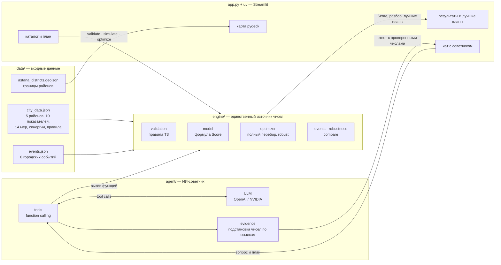
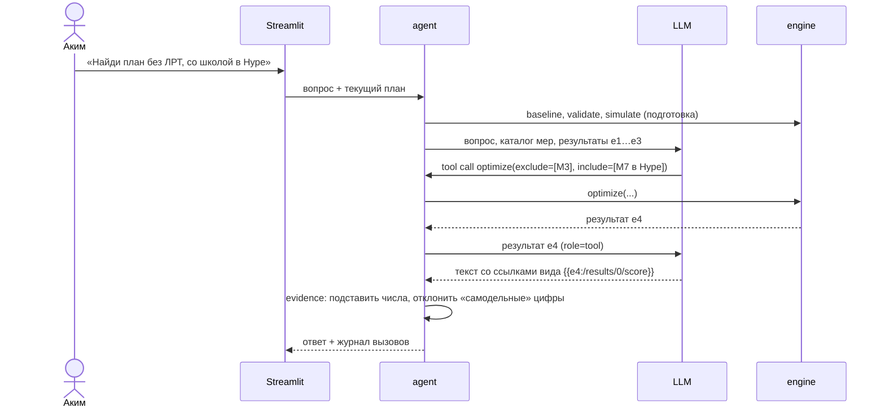

# Аким на 5 часов

**AI-симулятор управления Астаной: 5 решений, 100 у.е. бюджета, один Astana Quality of Life Score.**

Пользователь в роли акима выбирает 5 из 14 городских мероприятий для пяти районов Астаны и должен уложиться в бюджет 100 у.е. Детерминированный движок проверяет правила ТЗ и считает Astana Quality of Life Score, воспроизводя эталоны ТЗ: базовый Score **52.56**, пример из ТЗ **56.54**. ИИ-советник объясняет результат, риски и компромиссы, вызывая движок через function calling, и не пишет ни одного числа сам: каждое число в его ответе подставляется из расчёта.


> **Для жюри, 5 минут:** `run.bat` (Windows) или `bash run.sh` (Linux/macOS) запускает приложение с нуля.
> Проверка расчётов без ключа ИИ: `python -m pytest` (68 тестов) и `python check.py` (эталоны ТЗ, лучший план, устойчивость).

## Содержание

- [Ключевые возможности](#ключевые-возможности)
- [Скриншоты](#скриншоты)
- [Быстрый старт](#быстрый-старт)
- [Настройка ИИ-советника](#настройка-ии-советника)
- [Сценарий пользователя](#сценарий-пользователя)
- [Архитектура](#архитектура)
- [Как считается Score](#как-считается-score)
- [Проверка корректности](#проверка-корректности)
- [Ключевые результаты](#ключевые-результаты)
- [Почему LLM не считает числа](#почему-llm-не-считает-числа)
- [Городские события и устойчивость плана](#городские-события-и-устойчивость-плана)
- [Сравнение команд](#сравнение-команд)
- [Структура репозитория](#структура-репозитория)
- [Трактовки неоднозначностей ТЗ](#трактовки-неоднозначностей-тз)
- [Планы развития](#планы-развития)

---

## Ключевые возможности

- **Карта пяти районов.** pydeck-карта Астаны: цвет района — его оценка D (красный → жёлтый → зелёный), объёмный режим, клик открывает профиль района.
- **Все правила ТЗ.** Ровно 5 мер, бюджет ≤ 100 у.е., не более 2 мер одного направления, районы у районных мер, несовместимости. Невалидный план не получает Score, а все нарушения показываются сразу и по-русски.
- **Score с полным разбором.** «Было/стало» по каждому району и показателю, устранённые и новые критические значения, сработавшие синергии, вклад каждой меры в Score.
- **Оптимизатор полным перебором.** Все 1 407 050 сценариев (наборы мер × районы) проверяются меньше чем за секунду. Результат — гарантированно лучший план, а не эвристика.
- **ИИ-советник с function calling.** Объясняет план, отвечает на «что если» и сам проверяет альтернативы через движок. OpenAI или NVIDIA; без ключа работает офлайн-разбор.
- **Городские события.** 8 кризисов, реалистичных для Астаны: буран, авария на теплосети, смог, секвестр бюджета и другие.
- **Устойчивость плана (наша оригинальная фича).** Как план переживает каждое событие, какой район страдает сильнее и какой план лучший в худшем случае.
- **Сравнение команд.** Рейтинг планов, отставание от лидера и чем именно планы отличаются.
- **Воспроизводимость.** Запуск одной командой, 68 автотестов, `check.py` сверяет движок с эталонами ТЗ.

## Скриншоты

<!-- СКРИНШОТ: интерфейс ещё дорабатывается. Положите файлы в docs/screenshots/ и замените
     строки таблицы на картинки, например:  -->

| Экран | Что должно быть на скриншоте |
|---|---|
| *СКРИНШОТ: `docs/screenshots/01_city.png`* | Вкладка «Город и проекты»: карта районов, каталог мер, «Ваш план» |
| *СКРИНШОТ: `docs/screenshots/02_result.png`* | Вкладка «Результаты»: Score, изменения по районам, критические показатели |
| *СКРИНШОТ: `docs/screenshots/03_best_plans.png`* | Вкладка «Лучшие планы»: пять лучших планов оптимизатора |
| *СКРИНШОТ: `docs/screenshots/04_advisor.png`* | Вкладка «ИИ-советник»: ответ и журнал «Как советник пришёл к выводу» |

---

## Быстрый старт

Нужен **Python 3.11–3.14**. Проверено на Windows 11 с Python 3.11.6, 3.13.2 и 3.14.3: `run.bat` запускался из чистой копии репозитория.

```bash
git clone https://github.com/BAITC-Hacks/hack-d3b2c613-stupits.git
cd hack-d3b2c613-stupits
```

| Система | Одна команда |
|---|---|
| Windows | `run.bat` (или двойной щелчок по файлу) |
| Linux / macOS | `bash run.sh` |

Скрипт делает всё сам:

1. создаёт виртуальное окружение `.venv`, если его нет (сам находит Python 3.11–3.14);
2. ставит зависимости из `requirements.txt` и `requirements-ui.txt`; при следующих запусках повторно ставит, только если эти файлы изменились;
3. создаёт `.env` из `.env.example`, если его нет;
4. запускает приложение и открывает в браузере **http://localhost:8501**.

Первый запуск занимает несколько минут: скачивается около 150 МБ зависимостей. Дальше приложение стартует за секунды. Интернет нужен для установки и для подложки карты; расчёты, оптимизатор и офлайн-советник работают без сети. Остановить приложение — `Ctrl+C`.

Необязательные настройки: `PYTHON` — какой интерпретатор использовать, `PORT` — другой порт, `NO_BROWSER=1` — не открывать браузер.

```bash
PYTHON=python3.12 PORT=8502 bash run.sh      # Linux / macOS
set PORT=8502 && run.bat                     # Windows (cmd)
```

<details>
<summary>Запуск вручную, без скрипта</summary>

```bash
python -m venv .venv
source .venv/bin/activate                     # Windows: .venv\Scripts\activate
pip install -r requirements.txt -r requirements-ui.txt
cp .env.example .env                          # Windows: copy .env.example .env
python -m streamlit run app.py
```

</details>

<details>
<summary>Запуск в Docker</summary>

```bash
docker build -t akim5h .
docker run --rm -p 8501:8501 --env-file .env akim5h
```

Затем откройте http://localhost:8501. Ключ ИИ в образ не попадает: `.env` исключён в `.dockerignore` и передаётся только при запуске через `--env-file`, значения в нём пишутся без кавычек. Без `--env-file` приложение работает целиком, советник — в офлайн-режиме.

</details>

---

## Настройка ИИ-советника

**Ключ не обязателен.** Без него работает всё: карта, план, проверка правил, Score, оптимизатор. Советник в этом случае даёт детерминированный офлайн-разбор по данным движка.

Чтобы включить LLM, заполните `.env` (его создаёт `run.bat` / `run.sh`; файл в `.gitignore`, в репозиторий не попадёт):

```dotenv
OPENAI_API_KEY=ваш_ключ
OPENAI_MODEL=id_модели
OPENAI_BASE_URL=
```

| Переменная | OpenAI | NVIDIA (build.nvidia.com) |
|---|---|---|
| `OPENAI_API_KEY` | ключ `sk-…` | ключ `nvapi-…` |
| `OPENAI_MODEL` | модель с поддержкой function calling в Chat Completions API | id модели из каталога, у которой заявлен tool calling |
| `OPENAI_BASE_URL` | оставить пустым | `https://integrate.api.nvidia.com/v1` |

- Советник работает с любым OpenAI-совместимым API. Адрес указывается без `/chat/completions`, SDK добавляет его сам.
- Значения пишутся без кавычек. Переменные окружения процесса важнее `.env`.
- `.env` перечитывается при каждом запросе, поэтому перезапуск не нужен: нажмите «Обновить разбор» во вкладке «ИИ-советник».
- **Офлайн-режим** включается сам, если не заданы ключ или модель, а также при ошибке авторизации, сбое сети, тайм-ауте или ответе, не прошедшем проверку чисел. Ответ помечается «Советник работает в офлайн-режиме».

Подробности: [agent/README.md](agent/README.md).

---

## Сценарий пользователя

1. **Открыть город.** В шапке — оценка качества жизни (база **52,56**), остаток бюджета и счётчик «Выбрано проектов 0 из 5». На вкладке «Город и проекты» карта районов; клик по району открывает его профиль с показателями.
2. **Изучить проекты.** В каталоге 14 мер с фильтром по направлению. У каждой меры указаны стоимость, лаг и эффекты. В блоке «Правила и совместимость проектов» — правила ТЗ и несовместимые пары.
3. **Собрать план.** «Добавить проект»; для районной меры сначала выберите «Район реализации». Если меру добавить нельзя (нет бюджета, лимит направления, несовместимость), каталог сразу объясняет почему.
4. **Получить результат.** Когда выбрано 5 мер, расчёт запускается автоматически (или кнопкой «Рассчитать результат»). Невалидный план не получает Score, а все причины показываются списком.
5. **Разобрать результат.** Вкладка «Результаты»: Score и его изменение, изменения по районам и показателям, «Какие показатели остаются критическими», автоматический разбор советника.
6. **Сравнить с лучшими.** Вкладка «Лучшие планы» → «Найти лучший план»: пять лучших планов полного перебора. «Применить» подставляет план в ваш.
7. **Спросить советника.** Вкладка «ИИ-советник», например: «Найди план без ЛРТ с бюджетом до 80 у.е.». Советник сам вызывает движок. Блок «Как советник пришёл к выводу» показывает каждый вызов с аргументами и результатом.

**Контрольный сценарий** (значения в интерфейсе выводятся с запятой):

| Действие | Ожидаемый результат |
|---|---|
| Открыть приложение, ничего не выбирать | Оценка качества жизни **52,56** |
| Выбрать пример ТЗ: M7 (Нура), M8 (Нура), M10 (Нура), M12 (весь город), M5 (Сарыарка) | **56,54** (+3,99), стоимость 95, синергия M10 + M12 |
| «Лучшие планы» → «Найти лучший план» | План №1: **57,24**, стоимость 98 |
| Выбрать 4 проекта или превысить бюджет | Расчёт недоступен, причина названа явно |

---

## Архитектура

Главный принцип: **считает код, объясняет ИИ.** Зависимости идут в одну сторону: данные → движок → советник → интерфейс. Движок не знает ни про Streamlit, ни про LLM и проверяется отдельно. Интерфейс берёт числа из движка напрямую, поэтому основной сценарий работает и без советника.



| Слой | Отвечает за | Ключевые файлы |
|---|---|---|
| `data/` | Данные ТЗ, события, границы районов | `city_data.json`, `events.json` |
| `engine/` | Правила, Score, оптимизатор, события, устойчивость, сравнение. Чистые функции, ответы — JSON-словари | `model.py`, `validation.py`, `optimizer.py` · API: [engine/README.md](engine/README.md) |
| `agent/` | Цикл LLM с инструментами движка, проверка чисел, офлайн-разбор | `advisor.py`, `tools.py`, `evidence.py` |
| `app.py`, `ui/` | Карта, каталог, результаты, лучшие планы, чат | `app.py`, `ui/engine_adapter.py` |

Как советник отвечает на вопрос:



---

## Как считается Score

Все коэффициенты берутся из `data/city_data.json`, в коде нет «зашитых» чисел.

**Шаг 1. Новые показатели района** (10 показателей, шкала 0–100, 100 — нет проблемы):

```math
I'_{dk} = \mathrm{clip}\Big(I_{dk} + \sum_{m \in S:\ d \in Z_m} e_{mk}\cdot\frac{8 - L_m}{8} + B_{dk},\ 0,\ 100\Big)
```

**Шаг 2–3. Оценка района и города:**

```math
D_d = \sum_{k} w_k \, I'_{dk}, \qquad D_{avg} = \sum_{d} p_d \, D_d
```

**Шаг 4. Итог:**

```math
\mathrm{Score} = 0.7 \cdot D_{avg} + 0.3 \cdot \min_d D_d - 1.0 \cdot N_{crit}
```

| Обозначение | Смысл |
|---|---|
| `S`, `Z_m` | выбранные меры; зона действия меры: один район (district) или весь город (city) |
| `e_mk`, `L_m` | эффект меры на показатель; лаг в кварталах. За горизонт 8 кварталов реализуется доля (8 − L)/8: например, школа M7 с лагом 3 даёт S1 +16 × 5/8 = **+10** |
| `B_dk` | бонус синергии (M1+M2, M10+M12, M5+M6): фиксированный, лагом не масштабируется, даётся в районе первой меры пары |
| `w_k` | веса показателей: T1, T2, C1, C2 — 0.10; S1, S2, E2 — 0.11; E1, B1, B2 — 0.09 (сумма 1) |
| `p_d` | доли населения: Есиль 0.27, Алматы 0.24, Сарыарка 0.20, Нура 0.16, Байконур 0.13 |
| `N_crit` | число пар «район × показатель» со значением **строго меньше 40**; каждая стоит −1 балл |

**Зачем такая формула.** 70% веса — общий уровень города, 30% — самый слабый район: нельзя «вылизать» один район и забыть про Нуру. Штраф за критические значения не даёт оставить провалы.

**Расчёт по шагам:**

| | Расчёт | Score |
|---|---|---|
| База, без мер | 0.7 × 56.86 + 0.3 × 49.18 − 1 × 2 (в Нуре S1 = 38, S2 = 35) | **52.56** |
| Пример ТЗ | 0.7 × 58.08 + 0.3 × 52.96 − 1 × 0 (оба провала Нуры устранены) | **56.54** |

---

## Проверка корректности

Движок детерминирован, поэтому его корректность проверяется автоматически, без LLM и без ключа. Команды выполняются в окружении `.venv`: либо активируйте его, либо пишите `.venv\Scripts\python` на Windows и `.venv/bin/python` на Linux/macOS.

```bash
python -m pytest              # 68 тестов движка, ~7 с
python check.py               # эталоны ТЗ, топ-5, устойчивость, устойчивые планы
python -B -m agent.self_check # советник: настоящий движок, API подменён локальным транспортом
```

**Эталонные числа ТЗ, которые воспроизводит движок:**

| Проверка | ТЗ | Движок |
|---|---|---|
| Базовый Score | 52.56 | **52.56** ✅ |
| D_avg и N_crit базы | 56.86; 2 (S1, S2 в Нуре) | 56.86; 2 ✅ |
| Оценки районов `base_D` | 62.99 / 57.06 / 54.65 / 56.63 / 49.18 | совпадают все пять ✅ |
| Пример ТЗ: стоимость и Score | 95; ≈ 56.5 (+4.0) | 95; **56.54** (+3.99) ✅ |
| Пример ТЗ: синергия M10 + M12 | срабатывает | B1 +2 в Нуре ✅ |
| Самый дешёвый набор M9 + M11 + M10 + M12 + M4 | 61, валиден | 61, валиден; дешевле 61 допустимых наборов нет ✅ |

**Что ещё проверяют тесты:**

- каждое правило валидации по отдельности и все нарушения сразу;
- лаг, синергии, вклад мер; независимость от порядка решений; изменение набора меняет Score;
- оптимизатор перебирает всё пространство (число сценариев сверяется с комбинаторикой), а его результат совпадает с медленным перебором «в лоб»;
- с событием показатели действительно падают, без события — ответы прежние (52.56 и 56.54);
- `robustness` возвращает все события, режим устойчивости совпадает с перебором «в лоб», `compare` правильно ранжирует;
- битый файл данных отклоняется с понятной ошибкой, все ответы сериализуются в JSON.

`check.py` печатает те же эталоны с пометкой «совпадает» и выводит таблицы из раздела ниже.

---

## Ключевые результаты

**Полный перебор за доли секунды.** 2002 набора мер (C(14, 5)). 1181 из них проходят правила, не зависящие от районов (бюджет, направления, M1+M3), и только для них перебираются районы. Всего **1 407 050** сценариев «набор × районы», допустимых — 694 395. Все считаются векторно (numpy) по той же формуле, что и `simulate()`, за **~0.5 с** (0.45 с на Windows 11, Python 3.14).

| # | Score | Стоимость | План |
|---|---|---|---|
| 1 | **57.24** | 98 | M2 (весь город) + M3 (Нура) + M8 (Нура) + M9 (Нура) + M14 (весь город) |
| 2 | 57.23 | 91 | M3 + M4 + M8 + M9 (все в Нуре) + M14 (весь город) |
| 3 | 57.21 | 100 | M3 + M7 + M8 + M10 (все в Нуре) + M12 (весь город) |
| 4 | 57.19 | 88 | M3 + M8 + M9 + M10 (все в Нуре) + M14 (весь город) |
| 5 | 57.17 | 90 | M3 + M8 + M9 (все в Нуре) + M12 + M14 (весь город) |

- **Лучший план — 57.24 против 56.54 у примера ТЗ** (+0.70). Оптимум вкладывается в Нуру: это самый слабый район, а он входит в формулу с весом 30%. План закрывает оба критических провала соцсферы (M8, M9) и транспорт (ЛРТ M3).
- План №2 почти так же хорош (57.23) и стоит на 7 у.е. меньше: готовый аргумент для советника.
- **Самый устойчивый план** (`optimize(robust=True)`): **M1 + M4 + M8 + M9 в Нуре + M2 на весь город**, с синергией M1 + M2. Стоит 85 у.е., Score 56.83 — всего на 0.41 меньше лучшего, — но проходит при **всех 8 событиях**. Худший случай — буран, 54.37.

**Устойчивость к событиям** (Score при событии, в скобках — потеря):

| Событие | Лучший план (57.24, 98 у.е.) | Пример ТЗ (56.54, 95 у.е.) | Устойчивый план (56.83, 85 у.е.) |
|---|---|---|---|
| E1 Авария на теплосети (Алматы) | 55.90 (−1.34) | 55.21 (−1.34) | 55.49 (−1.34) |
| E2 Сильный буран (весь город) | 54.78 (−2.46) | 52.08 (−4.46) | 54.37 (−2.46) |
| E3 Рост ДТП (весь город) | 56.32 (−0.92) | 54.62 (−1.92) | 55.91 (−0.92) |
| E4 Прорыв водопровода (Байконур) | 57.01 (−0.23) | 55.32 (−1.23) | 55.60 (−1.23) |
| E5 Вспышка смога (Сарыарка) | 56.01 (−1.23) | 55.31 (−1.23) | 55.46 (−1.37) |
| E6 Сокращение бюджета (−15 у.е.) | ❌ не проходит: 98 > 85 | ❌ не проходит: 95 > 85 | **56.83 (без потерь)** |
| E7 Закрытие моста (Есиль) | 55.94 (−1.30) | 55.24 (−1.30) | 55.53 (−1.30) |
| E8 Наплыв новосёлов (Нура) | 55.57 (−1.66) | 53.88 (−2.66) | 55.17 (−1.66) |
| **Проходит при событиях** | 7 из 8 | 7 из 8 | **8 из 8** |

Что видно из таблицы:
- лучший по Score план ломается только о секвестр; к ударам по показателям он, наоборот, самый стойкий (если исключить секвестр, режим `robust` выбирает именно его);
- пример ТЗ ещё и хрупок: при буране теряет 4.46, а при наплыве новосёлов S2 в Нуре снова падает ниже 40 и возвращается штраф;
- устойчивый план платит за страховку 0.41 балла и держит резерв 15 у.е., зато не разваливается ни при одном событии.

---

## Почему LLM не считает числа

1. **Точность.** Языковые модели ошибаются в многошаговой арифметике, а ошибка во втором знаке — это уже расхождение с эталоном 52.56.
2. **Воспроизводимость.** Один и тот же план всегда даёт один и тот же Score, независимо от модели и формулировки вопроса. Жюри проверяет его без ключа.
3. **Проверяемость.** Корректность движка доказывают тесты; корректность счёта «в голове» модели доказать нельзя.

**Как это обеспечено в коде:**

- Модель получает только инструменты движка: `baseline`, `validate`, `simulate`, `optimize`. Каждое утверждение она обязана опирать на их реальные ответы.
- **Модель не печатает цифры.** Вместо числа она вставляет ссылку на поле ответа, например `{{e4:/results/0/score}}`. Модуль `agent/evidence.py` подставляет значение из расчёта. Ответ с «самодельной» цифрой, числительным («вдвое», «пять») или ссылкой на несуществующее поле отклоняется до показа пользователю.
- **Лимиты:** не больше 6 запросов к модели и 6 вызовов движка на ответ, тайм-ауты 20 с на запрос и 60 с на ответ. Если проверенного ответа нет, показывается детерминированный офлайн-разбор.
- **Прозрачность:** блок «Как советник пришёл к выводу» показывает каждый вызов движка с аргументами и результатом.
- **Движок заранее считает всё, что нужно для объяснения:** было/стало, вклад каждой меры с разложением по слагаемым формулы, эффективность на 10 у.е., подстановку чисел в формулу, пояснения к полям. Модели остаётся только объяснять.

---

## Городские события и устойчивость плана

Опциональная фича ТЗ «моделирование неожиданных городских событий», которую мы развили в оригинальную идею: **хороший аким выбирает не просто лучший план, а план, который не развалится при кризисе.**

Событие меняет стартовые условия **до** применения мер: ухудшает показатели в районе или по всему городу и/или меняет бюджет. Официальный Score всегда считается без событий. 8 событий хранятся в `data/events.json`:

| id | Событие | Где | Эффект | Score города без мер |
|---|---|---|---|---|
| E1 | Авария на магистральной теплосети | Алматы | C1 −15, C2 −5 | 51.22 |
| E2 | Сильный буран | весь город | T1 −6, T2 −5, B2 −4 | 48.10 |
| E3 | Рост ДТП в межсезонье | весь город | B2 −8, T1 −2 | 50.64 |
| E4 | Прорыв водопровода | Байконур | C1 −18, C2 −4, T1 −3 | 51.33 |
| E5 | Вспышка смога | Сарыарка | E2 −12, S2 −3 | 51.33 |
| E6 | Сокращение бюджета | весь город | бюджет 100 → 85 у.е. | 52.56 |
| E7 | Закрытие моста на капремонт | Есиль | T1 −10, T2 −4, B2 −2 | 51.26 |
| E8 | Наплыв новосёлов | Нура | S1 −6, S2 −5, T2 −4 | 50.89 |

```python
import engine
engine.list_events()                     # каталог событий и их удар по городу
engine.simulate(plan, event_id="E2")     # тот же расчёт после бурана
engine.robustness(plan)                  # Score при каждом событии, падение, кто пострадал сильнее, худший случай
engine.optimize(top_n=5, robust=True)    # план с лучшим Score в худшем случае среди событий
```

`robustness()` для каждого события возвращает Score плана, падение относительно обычных условий, сильнее всего пострадавший район, новые критические значения и готовую итоговую фразу. Режим `robust=True` перебирает те же 1.4 млн сценариев, но максимизирует **худший** Score среди событий. Мы считаем добавку мер один раз и оцениваем её от каждой стартовой точки, поэтому весь поиск занимает ~0.6 с. Пример вывода — в разделе [Ключевые результаты](#ключевые-результаты) и в `python check.py`.

## Сравнение команд

Опциональная фича ТЗ. `engine.compare({"Команда А": план_А, "Команда Б": план_Б, ...})` считает каждый план тем же `simulate()` и возвращает рейтинг: валиден ли план, Score, стоимость, разницу с базой, место, отставание от лидера, уникальные меры и отличия от плана лидера. Пример для трёх планов из раздела результатов:

```text
1 место — «Команда Б»: Score 57.24 (+4.68 к базе), стоимость 98 у.е.
2 место — «Команда В»: Score 56.83, отставание 0.41, стоимость 85 у.е. По сравнению с лидером: нет M3 (Нура), M14 (весь город); вместо этого M1 (Нура), M4 (Нура).
3 место — «Команда А»: Score 56.54, отставание 0.70, стоимость 95 у.е. По сравнению с лидером: нет M2 (весь город), M3 (Нура), M9 (Нура), M14 (весь город); вместо этого M7 (Нура), M10 (Нура), M12 (весь город), M5 (Сарыарка).
Есть во всех планах: M8 (Нура).
```

Невалидный план попадает в таблицу без места, с причинами. С `event_id` все команды сравниваются в условиях одного кризиса. Форматы ответов всех функций для интерфейса и советника описаны в [engine/README.md](engine/README.md).

---

## Структура репозитория

```text
.
├── app.py                     # точка входа Streamlit
├── run.bat, run.sh            # запуск одной командой (Windows / Linux, macOS)
├── Dockerfile, .dockerignore  # альтернативный запуск в Docker
├── check.py                   # сверка с эталонами ТЗ, топ-5, устойчивость
├── requirements.txt           # движок и тесты: numpy, pytest
├── requirements-ui.txt        # интерфейс и советник: streamlit, pydeck, pandas, openai, …
├── .env.example               # шаблон настроек ИИ (без ключей)
├── data/
│   ├── city_data.json         # районы, показатели, веса, 14 мер, синергии, правила, эталоны ТЗ
│   ├── events.json            # 8 городских событий
│   ├── astana_districts.geojson   # границы районов для карты
│   └── real_context*.json     # справочный слой OpenStreetMap (в Score не входит)
├── engine/                    # расчётный движок — единственный источник чисел
│   ├── data.py                # загрузка и проверка данных, матрицы numpy
│   ├── model.py               # формула Score (одна для simulate и optimize)
│   ├── validation.py          # правила ТЗ, все нарушения сразу
│   ├── simulation.py          # simulate(), baseline()
│   ├── optimizer.py           # полный перебор и режим устойчивости
│   ├── events.py, robustness.py, compare.py, report.py
│   └── README.md              # API движка для интерфейса и советника
├── agent/                     # ИИ-советник: function calling, проверка чисел, офлайн-режим
├── ui/                        # компоненты Streamlit: адаптер движка, карта, результаты, чат
├── tests/                     # 68 тестов pytest
├── docs/
│   ├── tz/                    # исходное ТЗ: постановка задачи и данные с правилами
│   └── for_designer/          # бриф и примеры ответов движка для дизайнера
├── fetch_districts.py         # границы районов из OpenStreetMap (Overpass API)
└── fetch_real_context.py      # школы, поликлиники, остановки, парки по районам из OSM
```

Границы районов в `data/astana_districts.geojson` сейчас схематичные: при их подготовке Overpass API был недоступен, и интерфейс об этом предупреждает. `python fetch_districts.py` скачивает реальные границы, когда сеть доступна. Слой объектов OSM справочный и на Score не влияет. Данные карты © участники OpenStreetMap, лицензия ODbL.

---

## Трактовки неоднозначностей ТЗ

| Вопрос | Наше решение |
|---|---|
| «5 решений по 5 направлениям» vs «не более 2 мер одного направления» | Следуем формальным правилам раздела 4: не более 2 мер на направление, значит затронуто минимум 3 направления. Так же устроен пример ТЗ (2/1/1/1). |
| Вклад меры в Score | Score полного набора минус Score набора без этой меры. Набор из 4 мер считается без проверки правил, вместе с мерой пропадают её синергии. Вклады не обязаны складываться в общий прирост (у примера 4.06 против 3.99): мешают `min()`, штраф и синергии. |
| Синергия, если мера-«адресат» общегородская | Бонус получают все районы. В текущих данных такого случая нет. |
| Повторы в наборе | Правила проверяются по решениям «как переданы»: повтор учитывается и в бюджете, и в лимите направления. Пользователь сразу видит все нарушения. |
| Шкала и clip | Границы 0–100 взяты из текста ТЗ: числового поля для них в JSON нет. `clip` применяется один раз к сумме эффектов и синергий. |
| Лаг ≥ горизонта | Эффект 0, а не отрицательный. |
| Равный Score у разных планов | Выше стоит более дешёвый: тот же результат за меньшие деньги. |
| Лимит бюджета в оптимизаторе | Может только ужесточить правило ТЗ (≤ 100 у.е.), но не ослабить его. |
| Как действует событие | Меняет стартовые показатели и/или бюджет до мер, лагом не масштабируется. Официальный Score — без событий. |
| План при сокращении бюджета | План выбран до события. Если он не укладывается в урезанный бюджет, он «не проходит», и это худший исход. Поэтому режим `robust` ищет планы, которые проходят при всех событиях. |
| Места при сравнении команд | Только у валидных планов, по Score до 2 знаков. При равенстве выше более дешёвый план, при равных Score и стоимости место общее. |
| Формат района | Принимается id (`nura`) или название («Нура»), регистр не важен. У общегородской меры `district: null`. |

---

## Планы развития

- **Реальные данные города.** Калибровать исходные показатели по статистике Бюро национальной статистики (stat.gov.kz), качеству воздуха Казгидромета и реальной транспортной нагрузке. Заменить схематичные границы районов на границы из OpenStreetMap (скрипт уже есть), а справочный слой OSM (школы, поликлиники, остановки, парки) — использовать в экспериментальном индексе доступности.
- **Жалобы жителей.** Подключить обращения граждан (iKomek 109, eOtinish): ИИ классифицирует их по темам и районам, и они становятся живым сигналом для показателя C2 «Скорость решения обращений» и для выбора приоритетных районов.
- **Открытые данные.** Портал открытых данных data.egov.kz и «Открытые бюджеты» — для реальных стоимостей мер и бюджета города.
- **События в интерфейсе.** Кнопка «Кризис!» со случайным событием и перераспределением бюджета, карта устойчивости плана, режим соревнования команд с общим рейтингом.
- **Горизонт в несколько лет.** Несколько раундов решений, расходы на содержание построенного, фронт Парето «Score — стоимость — равномерность районов».
- **Интерфейс на казахском и английском.**
